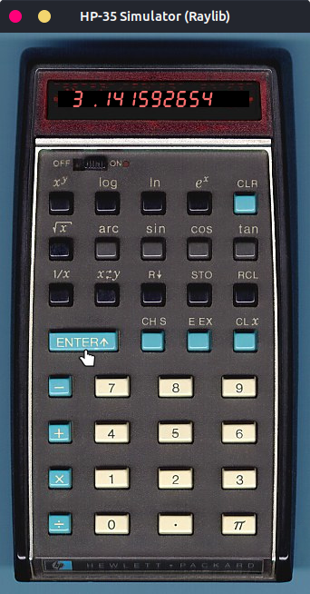

## HP-35 Simulator - programmed in C with [**Raylib**](https://www.raylib.com/)

Inspired by the [HP-35](https://www.hpmuseum.org/hp35.htm), the first pocket calculator with transcendental functions and the first with RPN (see also [Wikipedia](https://en.wikipedia.org/wiki/HP-35)). 

Some features of the original product may not be correctly simulated. 

All licenses and trademarks are the property of their respective owners. 

-----

### Security Notice

The code I released here into the public domain may appear in third-party projects. I do not maintain, endorse, or have any affiliation with such projects. Any malicious or deceptive use is unauthorized and should be reported to the hosting platform.

-----